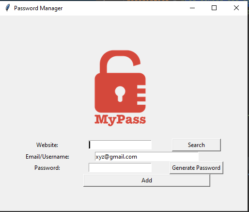

# Password Manager

A desktop app for generating and saving password for a particular site and retrieving it whenever required.

## Running on machine
- run main.py
- you can convert .py to .exe for windows

## Usage
1. Generate strong paswword for a website.
2. Save username and password.
3. Can retrieve the username and password for a website you saved whenever required.

## Contributing
Smart Attendance App is a free and open source project. Any contributions are welcome. Here are a few ways you can help:
 * Fork it!
 * Report bugs and make suggestions.
 * Translate the app.
 * Write some code. Please follow the code style used in the project to make a review process faster.
